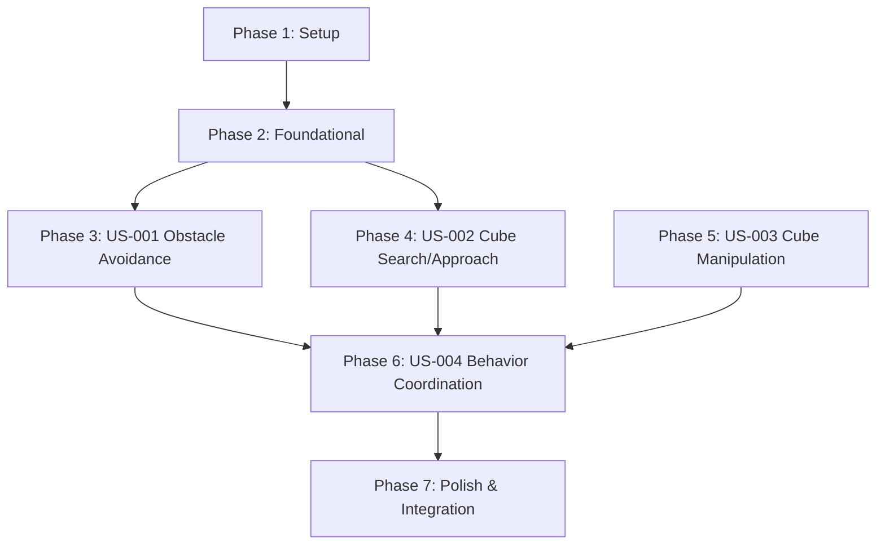

# Implementation Tasks: Fuzzy Control System

**Feature**: 005-fuzzy-controller  
**Branch**: `005-fuzzy-controller`  
**Spec**: [spec.md](./spec.md) | **Plan**: [plan.md](./plan.md) | **Research**: [research.md](./research.md)

---

## Overview

This document breaks down the fuzzy control system implementation into granular, executable tasks organized by user story. Each phase represents an independently testable increment of functionality.

**Total Estimated Tasks**: 52  
**Estimated Duration**: 7 days  
**Parallel Opportunities**: 15 tasks marked [P]

---

## Task Summary by Phase

| Phase | User Story | Tasks | Parallelizable | Duration |
|-------|------------|-------|----------------|----------|
| 1 | Setup | 6 | 2 | 0.5 days |
| 2 | Foundational | 8 | 4 | 1 day |
| 3 | US-001: Obstacle Avoidance | 10 | 3 | 1.5 days |
| 4 | US-002: Cube Search/Approach | 9 | 3 | 1.5 days |
| 5 | US-003: Cube Manipulation | 8 | 2 | 1 day |
| 6 | US-004: Behavior Coordination | 7 | 1 | 1 day |
| 7 | Polish & Integration | 4 | 0 | 0.5 days |

---

## Dependencies & Execution Order



**Critical Path**: Setup → Foundational → US-001 → US-004 → Polish

**Parallel Opportunities**:
- US-001, US-002, US-003 can be developed in parallel after Foundational phase
- Within each user story, tasks marked [P] can run concurrently

---

## Phase 1: Setup (6 tasks, 0.5 days)

**Goal**: Initialize project structure and install dependencies

**Tasks**:

- [ ] T001 Create `src/control/` module directory structure
- [ ] T002 Create `src/control/__init__.py` with module exports
- [ ] T003 [P] Create `src/control/config/` directory for YAML files
- [ ] T004 [P] Create `tests/control/` directory structure
- [ ] T005 Install scikit-fuzzy and PyYAML in `.venv` (update requirements.txt)
- [ ] T006 Create `notebooks/fuzzy_tuning.ipynb` for interactive development

**Completion Criteria**:
- ✅ All directories created
- ✅ Dependencies installed and importable
- ✅ Notebook opens without errors

---

## Phase 2: Foundational (8 tasks, 1 day)

**Goal**: Implement core fuzzy infrastructure needed by all user stories

**Tasks**:

- [ ] T007 Define `PerceptionInput` dataclass in `src/control/types.py`
- [ ] T008 Define `ControlOutput` dataclass in `src/control/types.py`
- [ ] T009 Define `RobotState` enum in `src/control/types.py`
- [ ] T010 [P] Create YAML schema for membership functions in `src/control/config/membership_functions.yaml`
- [ ] T011 [P] Create YAML schema for fuzzy rules in `src/control/config/fuzzy_rules.yaml`
- [ ] T012 [P] Implement `MembershipFunctionLoader` class in `src/control/membership_functions.py`
- [ ] T013 [P] Implement `RuleLoader` class in `src/control/rule_base.py`
- [ ] T014 Create logging configuration for fuzzy control in `src/control/logger.py`

**Completion Criteria**:
- ✅ All data types defined and type-checkable
- ✅ YAML schemas validate correctly
- ✅ Loaders can parse YAML files
- ✅ Logging outputs to `logs/fuzzy_control/`

**Tests** (if TDD requested):
- Unit test for dataclass serialization
- Unit test for YAML schema validation
- Unit test for loader error handling

---

## Phase 3: US-001 - Obstacle Avoidance (10 tasks, 1.5 days)

**User Story**: As the robot system, I need to detect obstacles and adjust my path to avoid collisions, so that I can navigate safely through the arena.

**Goal**: Implement fuzzy logic for safe obstacle avoidance

**Independent Test Criteria**:
- ✅ Robot maintains 0.3m clearance from obstacles
- ✅ Robot stops if obstacle <0.2m
- ✅ Smooth trajectory adjustments (no oscillations)
- ✅ Zero collisions in test scenarios

**Tasks**:

- [ ] T015 [P] [US1] Define `distance_to_obstacle` input variable with Gaussian membership functions in YAML
- [ ] T016 [P] [US1] Define `angle_to_obstacle` input variable with Gaussian membership functions in YAML
- [ ] T017 [P] [US1] Define `linear_velocity` output variable with trapezoidal membership functions in YAML
- [ ] T018 [US1] Define `angular_velocity` output variable with trapezoidal membership functions in YAML
- [ ] T019 [US1] Implement obstacle avoidance fuzzy rules (4 rules, priority=1) in YAML
- [ ] T020 [US1] Create `ObstacleAvoidanceController` class in `src/control/obstacle_avoidance.py`
- [ ] T021 [US1] Implement fuzzification for obstacle inputs in `ObstacleAvoidanceController`
- [ ] T022 [US1] Implement rule evaluation with priority=1 in `ObstacleAvoidanceController`
- [ ] T023 [US1] Implement centroid defuzzification for velocity outputs in `ObstacleAvoidanceController`
- [ ] T024 [US1] Add output clamping for safety (max velocities) in `ObstacleAvoidanceController`

**Completion Criteria**:
- ✅ Controller accepts `PerceptionInput` with obstacle data
- ✅ Controller outputs safe velocities
- ✅ Rules activate correctly based on distance/angle
- ✅ Output clamping prevents unsafe commands

**Tests** (if requested):
- Unit test: Very close obstacle → stop command
- Unit test: Close obstacle ahead → slow + turn
- Unit test: Obstacle on left → turn right
- Integration test: Navigate through obstacle course without collisions

---

## Phase 4: US-002 - Cube Search and Approach (9 tasks, 1.5 days)

**User Story**: As the robot system, I need to locate colored cubes and navigate toward them, so that I can position myself for grasping.

**Goal**: Implement fuzzy logic for cube detection and approach

**Independent Test Criteria**:
- ✅ Robot explores arena when no cube visible
- ✅ Robot turns toward detected cube
- ✅ Robot approaches while avoiding obstacles
- ✅ Robot stops at 0.15-0.25m from cube

**Tasks**:

- [ ] T025 [P] [US2] Define `distance_to_cube` input variable with Gaussian membership functions in YAML
- [ ] T026 [P] [US2] Define `angle_to_cube` input variable with Gaussian membership functions in YAML
- [ ] T027 [P] [US2] Define `cube_detected` crisp input (boolean) in code
- [ ] T028 [US2] Implement cube search fuzzy rules (2 rules, priority=3) in YAML
- [ ] T029 [US2] Implement cube approach fuzzy rules (5 rules, priority=2) in YAML
- [ ] T030 [US2] Create `CubeApproachController` class in `src/control/cube_approach.py`
- [ ] T031 [US2] Implement fuzzification for cube inputs in `CubeApproachController`
- [ ] T032 [US2] Implement rule evaluation with priority=2 in `CubeApproachController`
- [ ] T033 [US2] Implement search behavior (rotation pattern) when cube_detected=false

**Completion Criteria**:
- ✅ Controller accepts cube detection data from perception
- ✅ Search behavior executes when no cube visible
- ✅ Approach behavior activates when cube detected
- ✅ Stops at optimal grasping distance

**Tests** (if requested):
- Unit test: No cube → search rotation
- Unit test: Cube detected far → approach
- Unit test: Cube detected close → stop
- Integration test: Find and approach cube from random start position

---

## Phase 5: US-003 - Cube Manipulation (8 tasks, 1 day)

**User Story**: As the robot system, I need to grasp detected cubes and transport them to the correct deposit box, so that I can complete the collection task.

**Goal**: Implement fuzzy logic for manipulation actions

**Independent Test Criteria**:
- ✅ Robot aligns before grasping
- ✅ >90% grasp success rate
- ✅ Navigates to correct color-coded box
- ✅ Releases cube accurately

**Tasks**:

- [ ] T034 [P] [US3] Define `holding_cube` crisp input (boolean) in code
- [ ] T035 [P] [US3] Define `action` output variable (discrete: search, approach, grasp, navigate, release) in code
- [ ] T036 [US3] Implement manipulation fuzzy rules (3 rules, priority=2) in YAML
- [ ] T037 [US3] Create `ManipulationController` class in `src/control/manipulation.py`
- [ ] T038 [US3] Implement grasp alignment logic (fine-tune position if angle >5°)
- [ ] T039 [US3] Implement navigation to deposit box (lookup box position by cube color)
- [ ] T040 [US3] Implement release action trigger (at deposit box)
- [ ] T041 [US3] Add retry logic for failed grasps (max 2 attempts)

**Completion Criteria**:
- ✅ Grasp action triggers when aligned and close
- ✅ Navigation to box uses correct color mapping
- ✅ Release action deposits cube in box
- ✅ Retry logic handles failures

**Tests** (if requested):
- Unit test: Aligned + close → grasp action
- Unit test: Holding cube → navigate action
- Unit test: At box + holding → release action
- Integration test: Complete grasp-transport-release cycle

---

## Phase 6: US-004 - Behavior Coordination (7 tasks, 1 day)

**User Story**: As the robot system, I need to coordinate multiple behaviors (search, approach, grasp, deliver) in a logical sequence, so that I can complete the full task workflow.

**Goal**: Implement state machine and integrate all fuzzy controllers

**Independent Test Criteria**:
- ✅ Correct state transitions based on inputs
- ✅ Obstacle avoidance overrides other behaviors
- ✅ Full cycle: search → approach → grasp → deliver → release → search
- ✅ Recovery from failures

**Tasks**:

- [ ] T042 [US4] Implement `StateMachine` class in `src/control/state_machine.py`
- [ ] T043 [US4] Implement state transition logic (7 states, 8 transitions)
- [ ] T044 [US4] Add state transition logging to `logs/fuzzy_control/state_transitions.json`
- [ ] T045 [US4] Create `FuzzyController` main class in `src/control/fuzzy_controller.py`
- [ ] T046 [US4] Integrate obstacle avoidance, cube approach, and manipulation controllers
- [ ] T047 [US4] Implement rule priority mechanism (safety rules override task rules)
- [ ] T048 [US4] Implement RECOVERY state logic (backup, re-align, retry)

**Completion Criteria**:
- ✅ State machine transitions correctly
- ✅ All controllers integrated
- ✅ Priority mechanism works (obstacle avoidance always wins)
- ✅ Recovery handles failures

**Tests** (if requested):
- Unit test: State transitions for each trigger
- Unit test: Priority mechanism (obstacle overrides approach)
- Integration test: Full task execution (15 cubes)
- Integration test: Recovery from failed grasp

---

## Phase 7: Polish & Integration (4 tasks, 0.5 days)

**Goal**: Finalize integration, optimize performance, and validate success criteria

**Tasks**:

- [ ] T049 Create main control loop in `src/control/main_loop.py` (10Hz update rate)
- [ ] T050 Add performance profiling (measure inference time, ensure <10ms)
- [ ] T051 Create tuning notebook with interactive parameter adjustment
- [ ] T052 Run full validation suite (15 cubes, <10 min, zero collisions, >90% grasp)

**Completion Criteria**:
- ✅ Control loop maintains 10Hz
- ✅ Inference time <10ms
- ✅ All success criteria met (from spec.md)
- ✅ Tuning notebook functional

---

## Parallel Execution Examples

### Phase 2 (Foundational)
```bash
# Can run in parallel:
T010: Create membership_functions.yaml
T011: Create fuzzy_rules.yaml
T012: Implement MembershipFunctionLoader
T013: Implement RuleLoader
```

### Phase 3 (US-001)
```bash
# Can run in parallel:
T015: Define distance_to_obstacle variable
T016: Define angle_to_obstacle variable
T017: Define linear_velocity variable
```

### Phase 4 (US-002)
```bash
# Can run in parallel:
T025: Define distance_to_cube variable
T026: Define angle_to_cube variable
T027: Define cube_detected variable
```

---

## Implementation Strategy

### MVP Scope (Minimum Viable Product)
**Recommended first increment**: US-001 (Obstacle Avoidance) only
- Demonstrates core fuzzy logic working
- Validates infrastructure (YAML config, loaders, inference)
- Enables early testing of safety-critical behavior

### Incremental Delivery
1. **Week 1**: Setup + Foundational + US-001 → Robot avoids obstacles
2. **Week 2**: US-002 → Robot finds and approaches cubes
3. **Week 3**: US-003 + US-004 → Full task execution
4. **Week 4**: Polish + validation

---

## Validation Checklist

After completing all tasks, verify:

- [ ] All 52 tasks marked as complete
- [ ] All files created per plan.md structure
- [ ] All YAML configs validate against schemas
- [ ] All unit tests passing (if TDD)
- [ ] Integration tests passing (if requested)
- [ ] Performance criteria met (<10ms inference, 10Hz loop)
- [ ] Success criteria met (15/15 cubes, <10 min, zero collisions, >90% grasp)
- [ ] Code follows PEP8, has type hints, has docstrings
- [ ] DECISIONS.md updated with implementation choices
- [ ] TODO.md Phase 3 marked complete

---

## File Checklist

**Created by this feature**:

```
src/control/
├── __init__.py
├── types.py
├── logger.py
├── membership_functions.py
├── rule_base.py
├── obstacle_avoidance.py
├── cube_approach.py
├── manipulation.py
├── state_machine.py
├── fuzzy_controller.py
├── main_loop.py
└── config/
    ├── membership_functions.yaml
    └── fuzzy_rules.yaml

tests/control/
├── test_obstacle_avoidance.py
├── test_cube_approach.py
├── test_manipulation.py
├── test_state_machine.py
├── test_fuzzy_controller.py
└── test_integration.py

notebooks/
└── fuzzy_tuning.ipynb

logs/fuzzy_control/
├── state_transitions.json
└── rule_activations.json
```

---

## Next Steps

1. ✅ Tasks generated
2. ⏳ Review tasks.md for completeness
3. ⏳ Run `/speckit.implement` to execute tasks
4. ⏳ Validate and create PR

**Command to continue**: `/speckit.implement`
